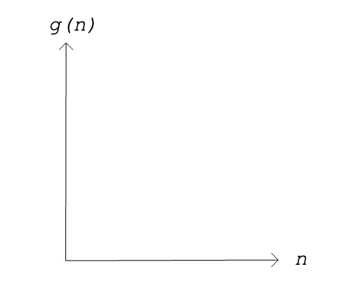

Big-O Notation In Detail
========================

In the introduction, we discussed big-O notation as a generalized way of describing and comparing an algorithm's time complexity relative to its input size. 

.. index:: big-o
.. index:: growth rate

More specifically, big-O is a notation for describing the **growth rate** of a time complexity function as its input size is increased. The time complexity function serves as an approximate model for the behavior of the actual algorithm classified by it. 

In mathematical terms, it is used to describe an algorithm as a function, ``f(n)``, which will never grow faster than at the upper bound its representative complexity function, ``g(n)``.
      
That is to say ``f(n) < O(g(n))`` with respect to their growth rates.

There is a lot to unpack here. And if your head is spinning, don't worry. In this section we will dissect the confusing parts of the definition and introduce the three elementary big-O values. This will prepare you for the more practical section to follow where you will learn the arithmetic used to calculate the big-O of steps and algorithms along with some other common big-O values.

.. index:: growth rate
.. index:: upper bound

Growth Rates & Bounds
---------------------

At its core big-O notation is concerned with the **growth rates** of algorithms as a function of their input size. The growth rate of a function is its incremental change in output as the value of its input is continuously increased. The most important part of big-O notation is *n*, the size of the input of the algorithm. 

.. admonition:: Example

   Suppose you have a list of items (or records) in no particular order, and you want to find a particular record.
   
   Searching through 5 records doesn't take very long, no matter what algorithm you use. But searching through 500,000,000 records can take a relatively short amount of time, or an almost incredibly long amount of time, depending on which algorithm you use. 

   In the worst case---when the record we are looking for is last in the list---it could take 500,000,000 operations to find the given item.
   
This example demonstrates why we need to perform algorithm analysis and be able to determine the big-O notation for our algorithms. Having an understanding of how well various algorithms perform will allow us to make informed decisions in choosing the best fit for the problem at hand.

In terms of big-O, the horizontal axis represents increasing input sizes, *n*. The vertical axis then represents the behavior of a complexity function *g(n)* at each increasing value of *n*. 

   The axes we will use to plot *n* and *g(n)*

.. index:: curve

By representing algorithms as mathematical functions, we are able to visualize their behavior on a graph. Each big-O value will have a characteristic behavior that is either a straight or curved line.

Big-O As the Worst Case
-----------------------

Big-O notation is to be able to compare the *upper bound* time complexity of candidate algorithms. When we visualize the limit of each algorithm's big-O growth rate, we are able to compare them to each other. 

Algorithms that quickly slope are less performant because the runtime increases quickly as the size of the input data set, *n*, increases.

Big-O notation determines the *worst case* performance of a given algorithm. It is possible, and even likely, that an algorithm will perform better than the worst case. However, to compare one algorithm to another, we always want to consider the worst case of each algorithm.

Below is a graph of the common big-O values you are likely to encounter. We will cover how each value relates in a practical sense to an algorithm in the coming section. For now, just consider how the complexity function of *n* controls the limiting behavior of these big-O values.

.. figure:: figures/function-examples.png
   :alt: Various functions of n
   :width: 600px

   Some functions of the variable *n* that commonly arise in algorithm analysis. (Image by `Cmglee <https://commons.wikimedia.org/wiki/User:Cmglee>`_, licensed under the Creative Commons Attribution-Share Alike 4.0 International license.) 

Check Your Understanding
------------------------

.. admonition:: Question

   **True/False**: Time complexity refers to the runtime in standard units of time (seconds, minutes, etc.)

.. False

.. admonition:: Question

   **True/False**: The limit of a complexity function is the point where its curve becomes vertical.

.. True

.. admonition:: Question

   **True/False**: The big-O of an algorithm is the upper bound representation of its behavior

.. True

.. admonition:: Question

   **True/False**: An algorithm's actual growth rate at will always be less than the upper bound of the big-O Value that classifies it

.. True
