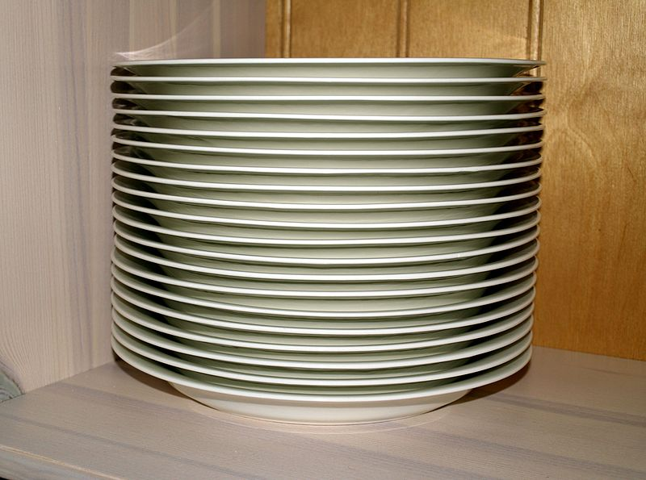

Stacks
======

A stack is an ordered data structure with primary operations for adding and removing elements:

- **push**: adds an element to the so-called *top* of the stack
- **pop**: returns the element at the top of the stack

As the name suggests, stack work very analogously to stacks of objects, such as plates

   A stack of plates (via `CC BY-SA 4.0 <https://creativecommons.org/licenses/by-sa/4.0/deed.en>`_, by Santeri Viinamäki)

To add a plate, you put it on the top. And to get a plate, you pick up the topmost plate on the stack. This is precisely how stacks work.

While a stack of plates is a vertical collection, we typically visualize the stack data structure as a linear structure, similar to an array or linked list. 

To see how stacks work, let's walk through an example using integers. We'll start with an empty stack, ``stack``:

::

   []

Now, let's *push* 6:

``stack.push(6)`` -> 

::

   [6]

And then push a few more items:

``stack.push(42)``
``stack.push(17)`` 
``stack.push(3)`` -> 

::

   [6, 42, 17, 3]

Now, when we *pop*:

``stack.pop()`` -> returns 3

::

   [6, 42, 17]

The pop operation returns the element at the top (or end) of the stack, and *alters* the stack so that it no longer contains that element.

.. index:: ! last-in, first out

Stacks are a **last-in, first out (LIFO)** structure. The last item that was added is the first to leave.

Structure
---------

A stack can be implemented as a (singly) linked list with additional push and pop operations.

With this implementation, the ``top`` of the stack is the *first* item in the linked list. This is counterintuitive to the way in which we typically visualize stacks. In the above abstract example, the push and pop operations affected the *rightmost* element in the collection. In the linked list implementation, however, the top is the *leftmost* node in the list.

Push
^^^^

Here is an implementation of ``push`` in pseudocode:

::

   function push(stack, val)

      new_node = node()
      new_node.value = val
      new_node.next = stack
      stack = new_node

We create a new node with the given value. Then we essentially prepend the node to the list by setting ``new_node.next`` to be the first item in the list, and the stack then becomes the new linked list. Recall that in its implementation, a linked list is just a pointer to the first node in the list.

It's worth noting that this operation is *O(1)*. 

Pop
^^^

Next, let's look at an implementation of ``pop``:

::

   function pop(stack)
      ret_val = stack.value
      stack = stack.next
      return ret_val

Here, we set ``stack`` (a reference to the first item in the collection) to be the *second* item in the collection. This effectively cuts off the first item. In order to be able to return the value of the first node, we store it in a variable first.

Applications
------------

.. index:: ! call stack

.. index::
   single: stack; call

Many of the use cases of stacks relate to very `low-level or esoteric computer science concepts <https://en.wikipedia.org/wiki/Stack_(abstract_data_type)#Applications_of_stacks>`_. The one commonly encountered use of stacks is in programming language runtimes, where we often refer to the **call stack**. When a program is run and a function/method is called, the function is *pushed* onto the call stack. The outer/calling function halts execution while it waits for the inner/called function to execute. This inner/called function may itself call other functions, adding more procedures to the call stack. When a procedure on the stack completes execution, it is *popped* from the stack. This transfers execution back to the procedure/function below it on the stack.